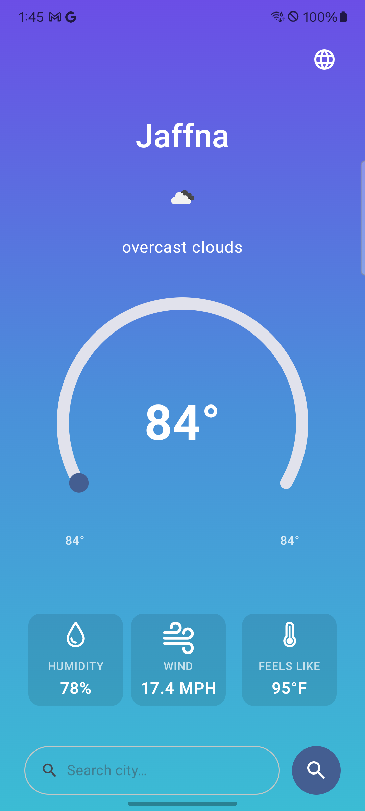
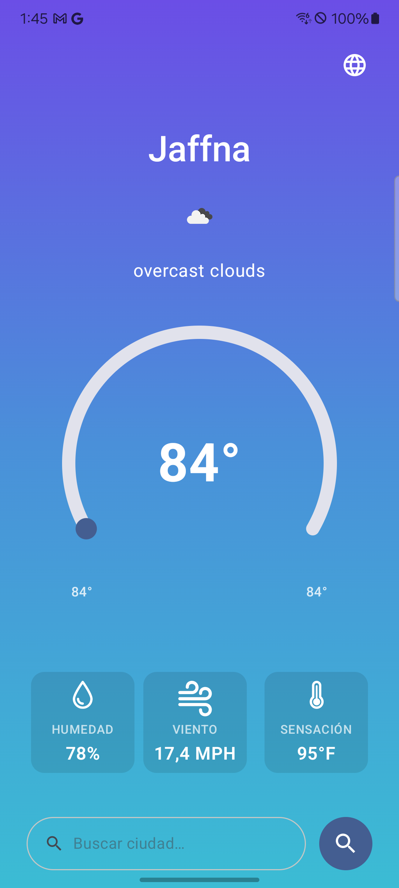
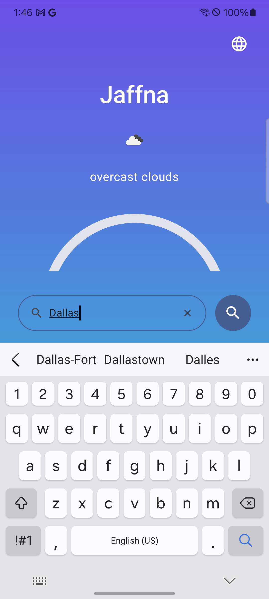
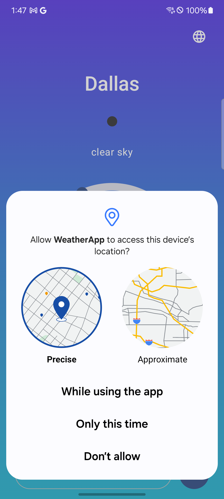
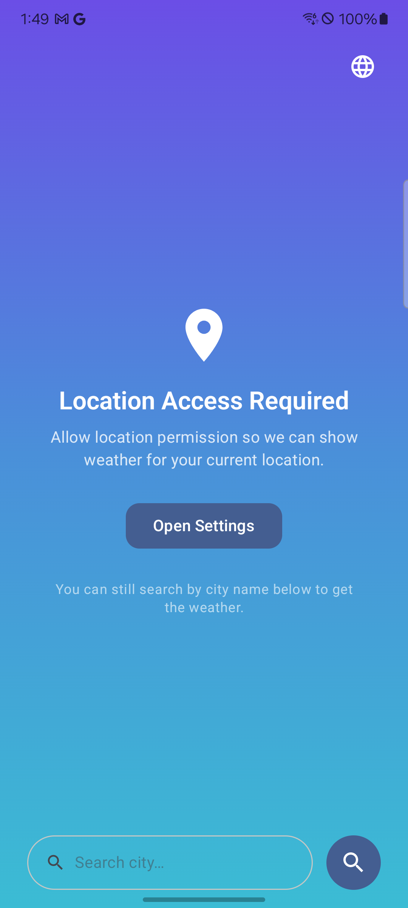

# WeatherApp

An Android weather application built with Kotlin and Jetpack Compose following Clean Architecture principles.

## Features

- **Current weather** — Fetches real-time weather data using the OpenWeatherMap API
- **Location-based weather** — Automatically detects current location via GPS
- **City search** — Search weather by city name using Android's Geocoder API
- **Recent city cache** — Remembers the last searched city using DataStore, restored on next launch
- **Multi-language support** — English, Spanish, and Tamil with a globe icon dropdown switcher
- **Permission handling** — Graceful UI when location permission is denied, with a direct link to app settings

## Screenshots

| Weather | Spanish | City Search | Location Permission | Permission Denied |
|---|---|---|---|---|
|  |  |  |  |  |

## Tech Stack

| Layer | Technology |
|---|---|
| Language | Kotlin |
| UI | Jetpack Compose + Material 3 |
| Architecture | Clean Architecture (Data / Domain / Presentation) |
| DI | Hilt |
| Networking | Retrofit 3 + Gson |
| Image Loading | Glide Compose |
| Location | FusedLocationProviderClient |
| Caching | DataStore Preferences |
| Navigation | Jetpack Navigation Compose |
| Testing | JUnit 4 + Mockito-Kotlin + Coroutines Test |

## Architecture

```
app/
├── core/
│   ├── datastore/         # DataStore interface + implementation
│   ├── di/                # Core DI modules
│   ├── extension/         # Kotlin extension functions (temperature, icon URL)
│   └── snackbar/          # Global SnackBar controller
├── data/
│   ├── cache/             # RecentCity repository implementation
│   ├── di/                # Data layer DI modules
│   ├── location/          # Location repository implementation
│   ├── mapper/            # DTO → Domain model mappers
│   └── remote/            # Retrofit API service + data sources
├── domain/
│   ├── model/             # Domain models
│   ├── repository/        # Repository interfaces
│   └── usecase/           # Use cases (GetWeather, GetCurrentLocation, RecentCity)
└── presentation/
    ├── feature/home/      # Home screen, ViewModel, components, state, events
    ├── navigation/        # NavHost + route definitions
    └── ui/                # Shared components, theme
```

## Setup

1. Clone the repository
2. Open in Android Studio
3. The API key is pre-configured in `BuildConfig.WEATHER_API_KEY`
4. Run on a device or emulator with API 30+

## API

Weather data provided by [OpenWeatherMap](https://openweathermap.org/api).

```
GET https://api.openweathermap.org/data/2.5/weather?lat={lat}&lon={lon}&appid={key}
```

## Localization

Supported languages:

| Language | Code |
|---|---|
| English | `en` |
| Spanish | `es` |
| Tamil | `ta` |

Switch language at runtime via the globe icon (🌐) on the top-right of the home screen.

## Testing

Unit tests cover:

- DTO → Domain mappers
- Exception → NetworkError mappers
- Remote data source
- Repository
- Use cases (GetWeather, GetRecentCity, SaveRecentCity)
- Extension functions (temperature conversion, weather icon URL)

Run tests:

```bash
./gradlew test
```

## Requirements

- Android Studio Hedgehog or newer
- Android SDK 30+
- Kotlin 2.3.20
